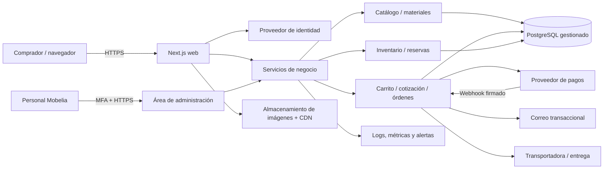

# Arquitectura Mobelia

## Estado actual (comprobado en el repositorio)

- Frontend Next.js App Router, React y TypeScript.
- Página principal compone componentes de interfaz y una calculadora en memoria.
- El selector mantiene productos de demostración en código.
- No hay conexión a base de datos, API de negocio, login/registro, carrito persistente, pedido confirmado, inventario ni pago.
- `models/Product.ts` y `models/Wood.ts` son modelos TypeScript en proceso; no crean tablas ni persisten datos.

No mostrar el prototipo como canal de compra productivo hasta construir y probar los recorridos críticos de [[Pedidos y cotizaciones]].

## Dirección aprobada

- Una sola tienda/empresa: Mobelia; muchos compradores y órdenes.
- PostgreSQL gestionado, con proveedor intercambiable.
- Aplicación Next.js desplegable en más de una instancia sin guardar estado de usuario en memoria local.
- API/servicios del servidor son propietarios de autorización, precio, promociones, impuestos, stock y transición de órdenes.
- PostgreSQL permanece en red privada; el navegador nunca accede directo a la base.
- Almacenamiento de objetos/CDN para imágenes; persistir metadatos en PostgreSQL.
- Integraciones de identidad, pagos, correo y transporte detrás de contratos de adaptador.

## Arquitectura lógica objetivo

## Límites y responsabilidades

### Interfaz

Renderiza el catálogo, opciones y estado visible; solicita operaciones al servidor. Los importes mostrados son informativos y se vuelven a calcular al cotizar/confirmar. Nunca enviar secretos al bundle cliente.

### Servicios de negocio

Validan entrada con esquemas, autentican y autorizan al actor, aplican reglas de precio/promoción/stock, ejecutan transacciones y producen errores explícitos. Separar catálogo, checkout, pagos, inventario y administración por módulos, no por microservicios prematuros.

### Persistencia

PostgreSQL guarda el registro durable de clientes, catálogo, operaciones comerciales, inventario y auditoría. Operaciones que involucran stock o creación de orden deben ser transaccionales/idempotentes. Especificación: [[Base de datos]] y [[Esquema de datos]].

### Trabajos asíncronos

Al principio puede bastar una cola duradera gestionada o patrón outbox en PostgreSQL para procesar correo, webhooks, reintentos y eventos de logística. No depender de un `setTimeout`/proceso de la instancia web para tareas que deban sobrevivir reinicios.

## Escalar sin rediseñar

1. **Lanzamiento:** monolito modular Next.js + PostgreSQL gestionado, pool de conexiones, CDN, backups, proveedor externo para auth/pagos. Medir antes de ampliar.
2. **Crecimiento:** réplicas web stateless; pooler PostgreSQL; consultas/indexes optimizados; caché solo para datos públicos; workers para tareas asíncronas.
3. **Mayor volumen:** separar workers; particionar tablas grandes guiado por mediciones; réplicas de lectura para informes; almacenamiento de objetos/CDN; retención/archivado.
4. **Separar servicios:** solo si una carga o equipo necesita escalar/desplegar de forma independiente. Mantener contratos y propiedad de datos claros.

No se fija una cifra de capacidad sin un SLO y una prueba de carga representativa. Véase [[Operación y despliegue]].

## Enlaces

[[Inicio]] · [[Decisiones de arquitectura]] · [[Base de datos]] · [[Seguridad y privacidad]] · [[Integraciones]]
