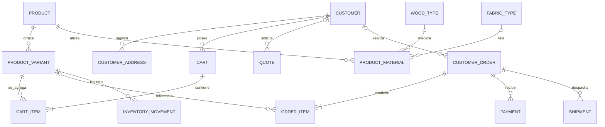

# Base de datos

> [!important] Estado
> Este es el **diseño objetivo**, no una base de datos ya desplegada. La aplicación actual es una página Next.js estática con datos de demostración: aún no tiene backend, persistencia, cuentas, checkout ni pagos. Véase [[Inicio]].

## Decisión de arquitectura

- Motor: **PostgreSQL gestionado**.
- La aplicación debe poder cambiar de proveedor sin cambiar el modelo del negocio. Usar PostgreSQL estándar, variables de entorno y una capa de acceso a datos; no depender de funciones exclusivas de un proveedor sin documentar la razón.
- Modelo comercial: una sola empresa, Mobelia, con muchos compradores. No se agrega `tenant_id` ni aislamiento artificial entre tiendas.
- La base de datos y sus copias de seguridad serán privadas; el navegador nunca se conecta directamente a PostgreSQL.
- Moneda inicial del catálogo y las órdenes: COP. Confirmar política contable, impuestos y redondeos con el área administrativa antes del lanzamiento.

Decisiones y aspectos por aprobar: [[Decisiones de arquitectura]].

## Mapa de entidades



`o|` expresa una relación opcional, por ejemplo una compra de invitado puede no tener una cuenta registrada. El diagrama es lógico: las claves foráneas, nulabilidad y reglas finales se deben materializar en migraciones SQL revisadas.

## Tablas objetivo

| Tabla | Responsabilidad | Claves y reglas principales |
|---|---|---|
| `customers` | Cuenta de cliente y datos de contacto mínimos | `id UUID`; correo normalizado único cuando existe; el proveedor de identidad conserva las credenciales |
| `customer_addresses` | Direcciones de envío/facturación | FK a cliente; varias por cliente; eliminar/anonimizar de acuerdo con retención legal |
| `products` | Producto base del catálogo | `id UUID`, SKU estable único, nombre, descripción, categoría, estado de publicación, precio base, timestamps |
| `product_variants` | Opciones que se compran y descuentan del inventario | FK a producto, SKU único, atributos de configuración validados, precio/ajustes, stock derivado del libro de movimientos |
| `product_images` | Imágenes ordenadas del catálogo | FK a producto o variante; guardar metadatos/URL, no binarios grandes |
| `wood_types` | Variedades de madera y propiedades | ID estable, porcentaje de recargo, tratamientos y ratings de resistencia con fuente/fecha |
| `fabric_types` | Telas, colores y propiedades | ID estable, referencia del proveedor, propiedades verificables y estado |
| `product_materials` | Materiales permitidos o incluidos por producto/variante | FKs a producto/variante y material; indicar obligatorio/opcional y ajuste de precio |
| `carts` / `cart_items` | Carrito persistente para compradores identificados | FK a cliente o token de invitado protegido; cantidad entera; no son órdenes |
| `quotes` / `quote_items` | Solicitudes de muebles personalizados y cotizaciones | Contacto, medidas/opciones, versión de precio, expiración y estados de aprobación |
| `customer_orders` | Cabecera de una compra confirmada | FK opcional a cliente; número público no secuencial; estados, moneda, totales y snapshots de direcciones |
| `order_items` | Líneas inmutables de la orden | SKU/nombre/configuración/precio unitario/impuestos/descuento copiados al comprar |
| `payments` | Intentos y resultado del proveedor de pago | FK a orden; ID externo único; estado; idempotencia; nunca guardar PAN/CVV |
| `shipments` | Entrega, transportadora, costo y tracking | FK a orden; estado y eventos de entrega |
| `inventory_movements` | Libro auditable de entradas/salidas/reservas | FK a variante; cantidad con signo, motivo, origen, usuario y fecha |
| `staff_roles` / permisos | Autorización de empleados | Identidad federada y permisos mínimos; separado de clientes |
| `audit_events` | Eventos administrativos sensibles | Actor, acción, objeto, fecha y metadata no secreta |

El modelo actual de TypeScript cubre parcialmente `products` y `wood_types`; todavía no implementa las entidades comerciales de esta lista. Véanse [[Esquema de datos]], [[Clientes y cuentas]], [[Pedidos y cotizaciones]], [[Inventario]] y [[Pagos y envíos]].

## Reglas de datos

- IDs internos UUID; SKU y slugs son identificadores comerciales, no claves primarias ni secretos.
- Dinero en `NUMERIC(14,2)` (o entero en la unidad menor si la política lo aprueba); nunca `float`/`double`. Guardar `currency` junto a importes y copiar precios a la orden.
- Fechas en `TIMESTAMPTZ`, almacenadas en UTC; presentar en la zona horaria del negocio.
- Stock entero no negativo. Todas las reservas/confirmaciones deben ser transaccionales y evitar sobreventa bajo concurrencia.
- Estados restringidos por enum/check o tabla de estados; las transiciones se validan en el servicio, se registran y no se borran de la historia.
- FK con reglas explícitas. Preferir desactivar/archivar referencias comerciales frente a borrar productos/materiales usados en órdenes.
- Índices mínimos: SKU único; producto publicado por categoría; FK de todas las relaciones; órdenes por cliente/estado/fecha; referencias externas de pago únicas; movimientos por variante/fecha.
- Aplicar paginación en búsquedas y listados; no cargar catálogos u órdenes completos en memoria.

## Conexiones y seguridad

```text
Navegador
   │ HTTPS, sesión segura
   ▼
Next.js (Server Components / Route Handlers / Server Actions validadas)
   │ servicio de negocio + autorización
   ▼
repositorios tipados + transacciones
   │ TLS, credencial de aplicación de mínimos privilegios
   ▼
PostgreSQL gestionado privado
```

- Secreto de conexión únicamente en variables del servidor (`DATABASE_URL`); nunca `NEXT_PUBLIC_*`.
- Usar pooler compatible con el proveedor y límites de conexiones calculados para todas las instancias de aplicación.
- Credencial runtime sin permisos DDL; credencial de migración distinta y no disponible durante tráfico normal.
- Validar entradas en el servidor; consultas parametrizadas; autorizar cada lectura/escritura de cuenta y orden por propietario y rol.
- La interfaz no es una frontera de seguridad. No confiar en precios, cantidades, stock, rol ni totales enviados por el navegador.
- TLS, backups cifrados, rotación de secretos, acceso administrativo MFA y bitácora de cambios.

## Operación del esquema

1. Escribir migración ascendente y, cuando sea posible, reversible.
2. Probarla en una copia representativa de staging; medir locks/tiempo y validar datos.
3. Respaldar antes de cambios destructivos.
4. Aplicar migración por pipeline con credencial específica.
5. Desplegar aplicación compatible con esquema anterior/nuevo durante una transición expand/contract.
6. Revisar métricas, errores, constraints e integridad después del cambio.

Backups/PITR, restore drills, alertas y runbooks: [[Operación y despliegue]]. Modelo lógico detallado: [[Esquema de datos]]. Requisitos de privacidad: [[Seguridad y privacidad]].

## Índice

- [[Arquitectura]]
- [[Decisiones de arquitectura]]
- [[Esquema de datos]]
- [[Clientes y cuentas]]
- [[Pedidos y cotizaciones]]
- [[Inventario]]
- [[Pagos y envíos]]
- [[Seguridad y privacidad]]
- [[Operación y despliegue]]
- [[Integraciones]]
