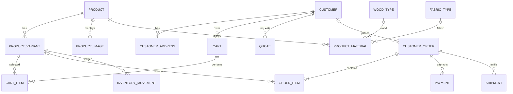

# Esquema de datos (objetivo PostgreSQL)

Modelo lógico para una tienda Mobelia con muchos compradores. No es una migración ejecutable ni evidencia de una base activa. Antes de producción, convertirlo en migraciones revisadas, probar restricciones y aplicar con backup.

## Relaciones

## Entidades y campos de negocio

| Entidad | Campos importantes | Comentarios |
|---|---|---|
| `customers` | `id`, `identity_subject`, `email_normalized`, `phone`, `name`, `created_at`, `updated_at`, `deleted_at` | Identidad la administra el proveedor externo; cuenta puede existir sin pedido previo |
| `customer_addresses` | `id`, `customer_id`, `label`, `recipient`, `phone`, `address_lines`, `city`, `region`, `postal_code`, `country_code`, timestamps | PII; guardar solo lo requerido para cotizar/entregar; órdenes copian snapshot |
| `products` | `id`, `sku`, `slug`, `name`, `description`, `category`, `base_price`, `currency`, `status`, `created_at`, `updated_at`, `archived_at` | Precio decimal; categoría estable; estados draft/active/archived |
| `product_variants` | `id`, `product_id`, `sku`, `attributes JSONB`, `price_delta`, `currency`, `active` | SKU de cada opción comprable; índices GIN solo si la consulta lo requiere |
| `product_images` | `id`, `product_id`, `variant_id`, `object_key`, `alt_text`, `position` | Archivo en object storage, no en BYTEA salvo caso justificado |
| `wood_types` | ID, nombre, recargo %, resistencia, tratamientos, proveedor/evidencia, estado | Rating con fuente/fecha; nunca usar como certificación |
| `fabric_types` | ID, nombre, color, proveedor, ajuste precio, propiedades/evidencia, estado | Compatibilidad se conecta por `product_materials` |
| `product_materials` | `product_id`, `variant_id`, `wood_type_id`, `fabric_type_id`, `required`, `price_delta`, `options` | Relación de materiales admitidos; reglas de exclusión validadas en servicio |
| `carts` | `id`, `customer_id NULL`, `guest_token_hash NULL`, `currency`, `expires_at`, timestamps | Token invitado aleatorio, firmado/hasheado y no enumerable |
| `cart_items` | `id`, `cart_id`, `variant_id`, `quantity`, `configuration JSONB`, timestamps | Validar configuración contra catálogo; precio actual se recalcula al checkout |
| `quotes` | ID, cliente/contacto, estado, vencimiento, moneda, totales, notas, autor | Para muebles a medida/volumen; aprobación y revisión auditables |
| `quote_items` | quote, descripción y medidas solicitadas, material/opciones, precio ofertado, cantidad | Snapshot de cada línea y versión de precio |
| `customer_orders` | ID interno, `order_number`, `customer_id NULL`, estado, moneda, subtotal, descuento, impuestos, envío, total, snapshots dirección, timestamps | Número público no secuencial; guest checkout mediante token de acceso seguro |
| `order_items` | orden, variante opcional, SKU/nombre/configuración snapshot, cantidad, unit price, descuento, impuesto, total | Inmutable tras confirmar excepto ajuste explícitamente auditado |
| `payments` | orden, proveedor, external ID, estado, moneda, amount, idempotency key, timestamps | Proveedor procesa tarjeta; aquí solo referencia y resultado |
| `shipments` | orden, carrier, tracking, status, costo, destino snapshot, eventos | Un pedido puede tener envíos parciales |
| `inventory_movements` | variante, delta entero, tipo, referencia, actor, fecha | Libro append-only; corrección por movimiento compensatorio |
| `inventory_reservations` | variante, orden/carrito, cantidad, expiry, estado | Reserva temporal y liberación; actualizar en transacción |
| `staff_roles` | subject externo, rol, scope | Solo personal Mobelia; no confundir con `customers` |
| `audit_events` | actor, acción, entidad, ID, timestamp, metadata filtrada | No registrar contraseñas, tokens, PAN, CVV ni payload sensible |
| `outbox_events` | ID, tipo, payload mínimo, created, processed, attempts | Entrega confiable de efectos externos después de commit |

## Integridad y rendimiento

- PK UUID; `UNIQUE` para SKU, slug cuando aplique, número de orden, identidad externa y `(provider, external_payment_id)`.
- FKs con `RESTRICT` para catálogo usado en órdenes; archivar referencias en lugar de borrarlas.
- `CHECK (quantity > 0)`, `stock >= 0`, dinero no negativo donde corresponda, porcentajes 0–100 y moneda válida.
- `NUMERIC`, nunca flotante, para importes; mantener moneda en cada carrito, quote, orden, pago y snapshot.
- `TIMESTAMPTZ` en UTC. Elegir timezone solo para presentación y reglas comerciales.
- Índices por claves foráneas; productos activos/categoría; órdenes `(customer_id, created_at DESC)` y `(status, created_at)`; pagos externos; movimientos/reservas por variante y fecha.
- `JSONB` solo para atributos configurables/versionados, no para ocultar campos centrales o sustituir relaciones.
- Listados paginados por cursor/keyset al crecer; no hacer `SELECT *` sin límite desde pantallas públicas.

## Transacción de checkout (invariante)

1. Validar sesión/guest token, dirección, opciones y cantidades.
2. Leer datos actuales de producto, variante, precios, descuentos, impuestos y disponibilidad en servidor.
3. Reservar stock con condición atómica/lock apropiado y expiración.
4. Crear orden y líneas con snapshots; crear intento de pago/idempotency key.
5. Commit durable antes de invocar PSP; usar outbox para operaciones diferibles.
6. Verificar webhook con firma/proveedor, deduplicar evento y aplicar una transición válida de forma idempotente.
7. Confirmar reserva/orden o liberar stock al fallar/caducar según política.

No aceptar el total del navegador como fuente de verdad. Para pagos, véase [[Pagos y envíos]].

## Cambios de esquema

Migraciones pequeñas, versionadas, con lock/tiempo evaluado, compatibilidad N/N-1 cuando se despliega sin downtime, backup probado y estrategia de rollback/forward. No ejecutar DDL con credenciales runtime. Véase [[Operación y despliegue]].

## Correspondencia con TypeScript

- `models/Product.ts`: modelo de dominio actual; todavía no representa todas las tablas, variantes, órdenes ni snapshots de persistencia.
- `models/Wood.ts`: modelo de dominio actual de material.
- Tipos de TypeScript no sustituyen constraints de PostgreSQL ni validación de entrada en servidor.

[[Base de datos]] · [[Catálogo de productos]] · [[Clientes y cuentas]] · [[Pedidos y cotizaciones]] · [[Inventario]] · [[Pagos y envíos]]
